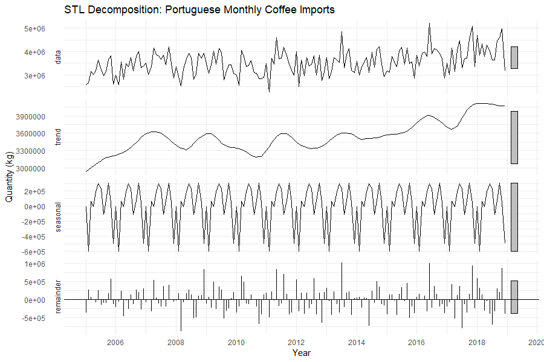
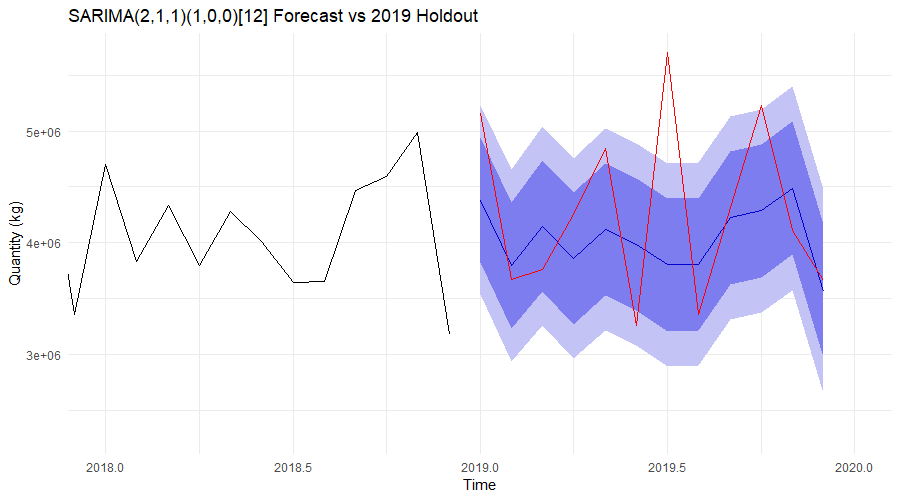

# Portuguese Coffee Imports: Econometric Time Series Forecasting

[](https://opensource.org/licenses/MIT)
[](https://www.r-project.org/)
[](https://rstudio.github.io/renv/)

End-to-end econometric time series analysis and $(S)\text{ARIMA}$ forecasting of monthly coffee import volumes into Portugal. This project implements a reproducible workflow—from seasonal decomposition and unit-root testing to model identification, residual diagnostic verification, and out-of-sample backtesting against smoothing and decomposition benchmarks.

---

## Business & Economic Context

Portugal has a distinct coffee culture characterized by high per-capita espresso consumption. Because domestic production is virtually nonexistent, the market depends almost entirely on green and roasted bean imports—primarily from Brazil, Vietnam, and Uganda.

The objective of this modeling pipeline is to:
1. **Isolate Structural Shifts:** Disentangle macro-trends from recurring seasonality across a clean 15-year historical baseline (January 2005 to December 2019; 180 monthly observations), purposely excluding COVID-19 pandemic distortions.
2. **Quantify Seasonality:** Capture recurring monthly trade dynamics across the annual import cycle.
3. **Out-of-Sample Projections:** Evaluate 12-month horizon point forecasts (calendar year 2019) with empirical 80% and 95% prediction intervals.

---

## Methodological Pipeline

```text
Raw Data (Monthly kg, 2005–2019)
       │
       ▼
Decomposition Analysis ────────► Classical Additive/Multiplicative & STL
       │
       ▼
Stationarity Testing ──────────► ADF & KPSS Tests (d = 1, D = 0)
       │
       ▼
Model Identification ──────────► ACF/PACF Grid Search & Estimation via AICc
       │
       ▼
Diagnostic Verification ───────► Ljung-Box Test & Residual Normality Checks
       │
       ▼
Out-of-Sample Evaluation ──────► Holdout Validation vs Holt-Winters & Decomp
```

### 1. Trend & Seasonal Decomposition
Monthly series components were analyzed through Classical Additive, Classical Multiplicative, and Loess-based STL decomposition:

$$Y_t = T_t + S_t + R_t$$

Where:
* $Y_t$: Observed monthly import volume (kg)
* $T_t$: Trend-cycle component (capturing steady upward demand growth)
* $S_t$: 12-month seasonal pattern
* $R_t$: Remainder / irregular market shocks



### 2. Stationarity & Order of Differencing
Non-stationarity in mean was evaluated using dual unit-root testing on the training set (2005–2018):
* **Differencing:** Seasonal differencing was unnecessary ($D=0$), while a single regular difference ($d=1$) achieved mean stationarity.
* **Augmented Dickey-Fuller (ADF):** Statistically significant rejection of unit-root null ($\text{Dickey-Fuller} = -7.2353$, $p = 0.01$).
* **KPSS Test:** Failed to reject the null hypothesis of stationarity ($\text{KPSS Level} = 0.0396$, $p = 0.10$).

$$\Delta Y_t = (1 - B) Y_t$$

### 3. Model Identification: $\text{SARIMA}(2,1,1)(1,0,0)_{12}$
ACF and PACF signatures of $\Delta Y_t$ indicated non-seasonal $\text{AR}(2)$, $\text{MA}(1)$, and seasonal $\text{SAR}(1)$ dynamics at lag 12. The final estimated model specification is:

$$(1 - 0.1253B - 0.2204B^2)(1 - 0.5006B^{12})(1 - B)Y_t = (1 + 1.0000B)\varepsilon_t$$

Where:
* Non-seasonal $\text{AR}(2)$ coefficients capture short-term persistence.
* Seasonal $\text{AR}(1)$ ($0.5006$, $p < 0.0001$) captures annual cyclicality.
* $\sigma^2$ estimated as $1.767 \times 10^{11}$ with $\text{AIC} = 28.85$ and $\text{BIC} = 28.96$.

### 4. Residual Diagnostics
Model adequacy was verified through residual diagnostic checks:
* **Autocorrelation:** Ljung-Box test across multiple lags yields $p > 0.05$, confirming that residuals behave as white noise without unaccounted temporal dependence.
* **Distribution:** Q-Q plots confirm residuals are approximately Gaussian, with minor tail variation reflecting irregular trade shocks.

### 5. Out-of-Sample Performance (2019 Holdout)
Models were trained on 2005–2018 ($n=168$) and validated against the full 12-month 2019 holdout set ($n=12$):

| Model | ME (kg) | RMSE (kg) | MAE (kg) | MPE (%) | MAPE (%) |
|---|---|---|---|---|---|
| **Holt-Winters Additive** | 37,615.75 | 676,075.8 | 526,285.0 | -1.72% | 12.54% |
| **Classical Additive Decomposition** | 146,413.29 | 684,752.4 | 527,116.9 | 0.92% | 12.21% |
| **$\text{SARIMA}(2,1,1)(1,0,0)_{12}$** | 237,346.20 | 755,179.3 | 582,514.1 | 3.04% | 12.83% |

*Insight:* While $\text{SARIMA}(2,1,1)(1,0,0)_{12}$ provides a statistically sound parametric model with white noise residuals, Holt-Winters Additive smoothing yielded superior out-of-sample RMSE and ME due to sharp, high-volatility trade volume swings in early 2019.



---

## Project Structure

```text
portugal-coffee-import-forecasting/
├── assets/
│   ├── decomposition_plot.png
│   └── forecast_intervals.png
├── data/
│   └── coffee_imports_pt.csv
├── reports/
│   └── final_report.pdf
├── LICENSE
├── README.md
└── analysis.R
```
